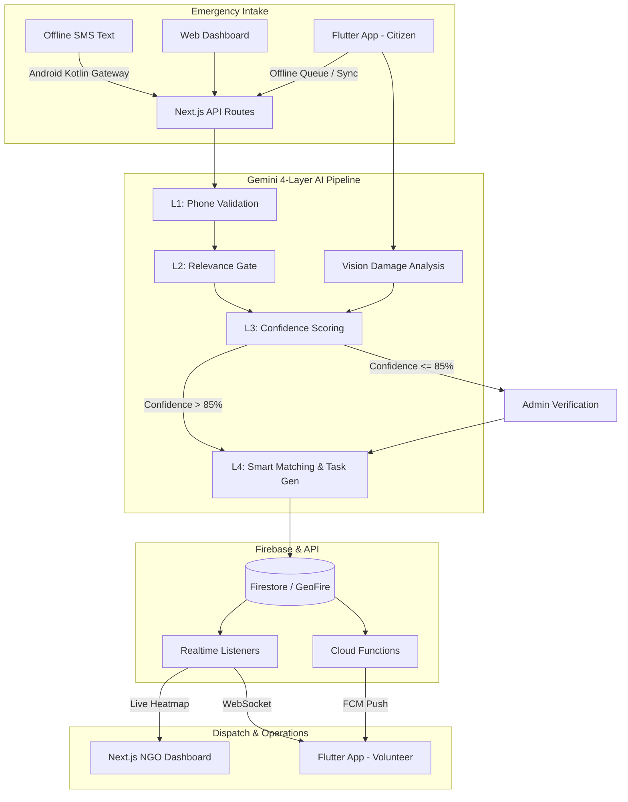
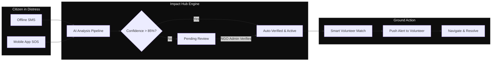
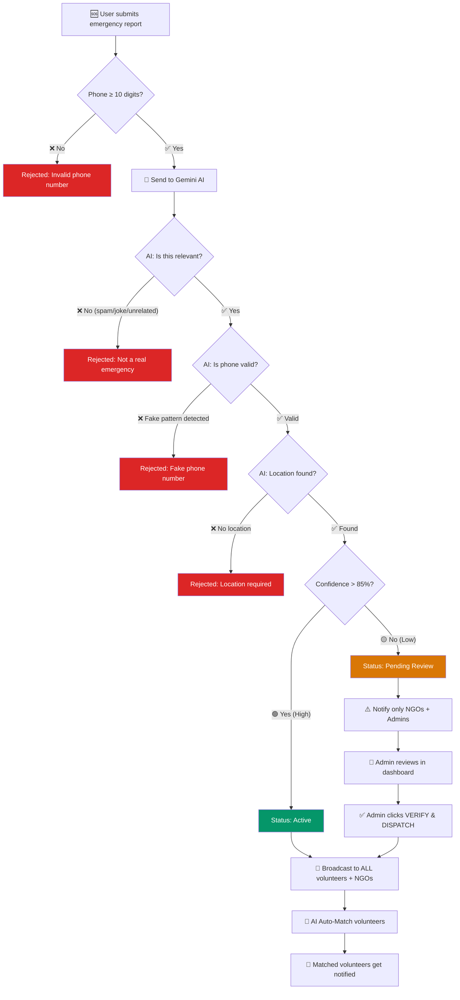
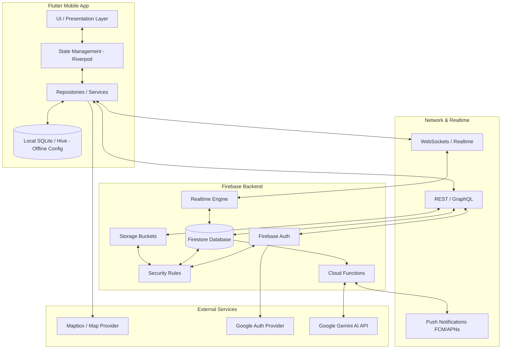

<p align="center">
  
  
  
  
  
  
</p>

<h1 align="center">Impact Hub 🌍</h1>
<h3 align="center">Smart Resource Allocation — Data-Driven Volunteer Coordination for Social Impact</h3>

<p align="center">
  <em>Turn scattered field reports into real-time heatmaps. Match volunteers to urgent needs in seconds, not hours.</em>
</p>

---

## 🎯 The Problem

Local social groups and NGOs collect massive amounts of important information about community needs through paper surveys, SMS, and WhatsApp. However, this valuable data is often **scattered across different silos**, making it impossible to see the biggest problems clearly.

| The Challenge | The Impact |
|---------------|------------|
| **Disconnected Data** | Paper surveys, SMS, and spreadsheets create chaotic, disconnected data silos. |
| **Connectivity Drop** | During disasters, internet access fails, leaving victims unable to report emergencies. |
| **Slow Dispatch** | By the time data is compiled manually, the ground reality has already changed. |
| **Poor Coordination**| Volunteers and resources are sent to the wrong places, duplicating efforts. |

---

## 💡 The Solution

**Impact Hub** is an end-to-end, multi-platform ecosystem designed to gather, verify, and act on emergency data instantly. 

1. **Anywhere Reporting:** Gather reports via web, mobile app, or even offline SMS text messages.
2. **AI-Powered Triage:** A 4-layer AI pipeline reads, validates, categorizes, and assesses confidence of incoming reports.
3. **Real-time Intelligence:** Live heatmaps and geographic clusters show command centers exactly where needs are concentrated.
4. **Smart Dispatch:** Matches available volunteers with specific tasks based on proximity, skills, and emergency severity.

---

## 🚀 The Ecosystem (Key Features)

### 1. 📡 The Offline-to-Cloud Pipeline
Internet goes down in a crisis? We have you covered. Victims can send a standard SMS starting with "SOS" to a dedicated Command Hub number. A dedicated Android device running a custom native Kotlin background service intercepts the offline SMS and silently forwards it directly to our Firebase servers using the native Firebase SDK. The AI automatically extracts the location, emergency type, and needs without the victim ever needing a smartphone or internet connection.

### 2. 🧠 The 4-Layer AI Engine
Every emergency report passes through our rigorous [Gemini-powered AI Pipeline](./AI_README.md):
- **Layer 1 (Validation):** Rejects invalid or fake phone numbers.
- **Layer 2 (Relevance Gate):** Rejects spam and non-emergencies (e.g., food delivery requests).
- **Layer 3 (Confidence Verification):** Scores confidence (0-100%). >85% auto-dispatches. ≤85% flags for admin manual verification.
- **Layer 4 (Smart Matching):** Matches verified incidents to volunteers based on skills, location, and severity. Also handles vision analysis for damage severity grading.

### 3. 📱 Field-Ready Mobile App
Our [Flutter Mobile App](./FLUTTER_MOBILE_README.md) is built for volunteers on the ground and citizens in distress.
- **Offline-First:** Reports queue locally (SQLite/Hive) if offline and sync immediately when connectivity returns.
- **GeoFire Spatial Queries:** Locates nearby incidents and routes volunteers efficiently using Mapbox.
- **Live Updates:** Real-time push notifications via FCM and Firebase Cloud Functions.

### 4. 💻 Web Command Center
The Next.js operational dashboard allows NGOs and administrators to see the big picture.
- **Live Heatmaps:** Critical zones pulse live on interactive operational maps.
- **Admin Verification Panel:** Human-in-the-loop verification for AI reports with low confidence.
- **Analytics:** Post-mission impact reports and response metrics.

---

## 🏗️ Complete System Architecture



---

## 👤 User Flow



---

## 🛠️ Comprehensive Tech Stack

| Domain | Technology | Purpose |
|--------|-----------|---------|
| **Web Frontend** | Next.js 16, React 19, Tailwind 4, Framer Motion | NGO dashboards, Server components, live heatmaps |
| **Mobile App** | Flutter 3, Riverpod, Mapbox | Offline-first reporting, Volunteer routing, Geo-tracking |
| **Backend & DB** | Firebase, Firestore, GeoFire | Realtime datastore, Spatial queries, Authentication |
| **AI Engine** | Google Gemini 2.5 Flash / Flash Lite | NLP Extraction, Spam filtering, Vision processing, Auto-matching |
| **Automation** | Android Native (Kotlin) | SMS to Cloud bridging for offline crisis zones |
| **Infrastructure** | Google Cloud, Firebase Cloud Functions | Serverless compute, Push notifications (FCM) |

---


## 📅 Roadmap

| Phase | Milestone | Status |
|-------|-----------|--------|
| **Phase 1** | Next.js Command Center, AI Pipeline (Text & Vision), Mock Auth | ✅ Complete |
| **Phase 2** | Flutter Mobile App, Firebase Realtime, Offline Queue | ✅ Complete |
| **Phase 3** | Android Native SMS Bridge, Complete GeoFire Heatmaps | ✅ Complete |
| **Phase 4** | Multilingual Voice Intake, Pre-positioning Resources via ML | ✅ Complete |

---


<p align="center">
  Built with ❤️ for <strong>Hackathon Excellence</strong>
</p>


---

# 📡 The Offline-to-Cloud Pipeline Deep Dive

During a disaster, internet and data networks are usually the first things to go down. Our system is built so that victims don't need an app, a smartphone, or an internet connection to get help. All they need is a basic cellular signal. 

Here is exactly how a simple text message turns into a live rescue mission:

### 1. The SOS Text (No Internet Required)
A victim in a crisis zone takes out any phone (even an old keypad phone) and sends a standard SMS text message to our dedicated Command Hub phone number. They just start the message with our trigger word (e.g., "SOS") and describe their situation. 
* *Example: "SOS structural collapse at sector 4, 10 people trapped, need medics"*

### 2. The Bridge (Android Native Kotlin Service)
We have a central Android phone stationed in a safe zone with an internet connection. This phone acts as the bridge. We built a custom **Android Native App** using **Kotlin** that utilizes Android's `BroadcastReceiver` API to constantly listen for incoming texts. The second it sees a text starting with "SOS", the Kotlin background service instantly grabs the message and silently forwards it directly to our Firebase backend using the native Firebase SDK.

### 3. The Brain (Firebase & Gemini AI)
The message arrives in our **Firestore** database, which triggers a **Firebase Cloud Function**. We use Google's **Gemini 2.5 Flash AI** to instantly read the messy, panicked text message and cleanly extract the exact data our rescue teams need:
* **Location:** Sector 4
* **Type of Emergency:** Structural Collapse
* **Priority:** HIGH
* **Resources Needed:** Medics

### 4. The Live Map (GeoFire & Dashboard)
Once the Gemini AI organizes the data, it is saved directly back into Firestore with GeoFire spatial coordinates. The absolute second that data hits the database, our Next.js web dashboard updates automatically via Firebase Realtime Listeners. A red priority pin drops onto the live digital map, giving rescue dispatchers the exact coordinates and details they need to send help immediately.

---


# 🧠 AI System Documentation
### How AI Powers Every Emergency Request from Submission to Dispatch

<p align="center">
  <em>Every emergency report passes through a multi-layer AI pipeline that validates, verifies, classifies, and routes it — ensuring only genuine emergencies reach responders, and the right volunteers are matched instantly.</em>
</p>

---

## 📋 Table of Contents

- [AI Pipeline Overview](#-ai-pipeline-overview)
- [Layer 1 — Input Validation](#-layer-1--input-validation)
- [Layer 2 — AI Relevance Gate](#-layer-2--ai-relevance-gate)
- [Layer 3 — Confidence-Based Verification](#-layer-3--confidence-based-verification)
- [Layer 4 — Smart Volunteer Matching](#-layer-4--smart-volunteer-matching)
- [API Routes](#-api-routes)
- [AI Models Used](#-ai-models-used)
- [Emergency Flow Diagram](#-emergency-flow-diagram)
- [Confidence Score UI](#-confidence-score-ui)
- [Admin Verification](#-admin-verification-panel)

---

## 🔄 AI Pipeline Overview

Every emergency report — whether text, voice, or image — flows through a **4-layer AI pipeline** before reaching responders:

```
┌─────────────────────────────────────────────────────────────────────┐
│                    EMERGENCY REPORT SUBMITTED                       │
│              (Text / Voice Transcription / Image)                   │
└──────────────────────────┬──────────────────────────────────────────┘
                           │
                           ▼
              ┌────────────────────────┐
              │   LAYER 1: VALIDATION  │  Phone number check (regex + AI)
              │   ❌ Reject if invalid │  Minimum 10 digits, no fake patterns
              └────────────┬───────────┘
                           │ ✅ Pass
                           ▼
              ┌────────────────────────┐
              │  LAYER 2: RELEVANCE    │  Is this a real emergency?
              │  ❌ Reject if spam     │  AI checks against Impact Hub concept
              └────────────┬───────────┘
                           │ ✅ Relevant
                           ▼
              ┌────────────────────────┐
              │  LAYER 3: CONFIDENCE   │  AI confidence scoring (0-100%)
              │  🟢 >85% = Auto-dispatch│
              │  🟡 ≤85% = Pending Review│
              └────────────┬───────────┘
                           │
                ┌──────────┴──────────┐
                │                     │
         ▼ >85%                ▼ ≤85%
   ┌──────────────┐     ┌──────────────────┐
   │ AUTO-DISPATCH │     │  PENDING REVIEW   │
   │ Status: Active│     │  Notify NGO/Admin │
   │ Broadcast ALL │     │  Wait for verify  │
   └──────┬───────┘     └──────────────────┘
          │
          ▼
   ┌──────────────┐
   │   LAYER 4:   │  AI matches volunteers by skills,
   │ SMART MATCH  │  location, and incident type
   └──────────────┘
```

---

## 🛡️ Layer 1 — Input Validation

**Purpose:** Block invalid data before it even reaches the AI.

### Phone Number Validation (3 Checks)

| Check | Where | Logic |
|-------|-------|-------|
| **Frontend Regex** | `emergency/page.tsx` | Strips non-digits, rejects if < 10 digits |
| **Server Regex** | `api/ai/analyze/route.ts`, `api/ai/vision/route.ts` | Same regex check server-side (defense in depth) |
| **AI Pattern Detection** | Gemini prompt | Detects fake patterns: `0000000000`, `1234567890`, repeated digits |

**Example rejections:**
```
❌ "12345"         → Too few digits (frontend + server block)
❌ "0000000000"    → AI detects repeating pattern
❌ "1234567890"    → AI detects sequential pattern
✅ "9876543210"    → Valid 10-digit number, passes all checks
```

### What the AI checks:

The AI receives the phone number in the prompt and returns:
```json
{
  "phone_valid": true,          // or false
  "phone_issue": null           // or "The number contains only repeating digits"
}
```

If `phone_valid` is `false`, the API returns a **400 error** with the AI's explanation and **no incident is created**.

---

## 🎯 Layer 2 — AI Relevance Gate

**Purpose:** Ensure only genuine disaster/humanitarian/community emergency reports are processed. Reject spam, jokes, unrelated requests.

### What qualifies as "relevant" to Impact Hub:

| ✅ Accepted | ❌ Rejected |
|-------------|-------------|
| Floods, earthquakes, fires | Food delivery orders |
| Medical emergencies | Tech support requests |
| Infrastructure damage | Jokes, memes, random text |
| Evacuations needed | Advertising / spam |
| Water/food/shelter shortages | Personal complaints (non-emergency) |
| Community safety threats | Selfies, food photos (vision) |

### How it works:

The AI prompt explicitly instructs Gemini:

> *"If the report is about something UNRELATED to disaster relief, humanitarian aid, or community emergencies (e.g., ordering food delivery, tech support, jokes, random text, advertising, personal complaints unrelated to emergencies), set `is_relevant` to false."*

The AI returns:
```json
{
  "is_relevant": false,
  "rejection_reason": "This appears to be a food delivery order, not a disaster or humanitarian emergency."
}
```

If `is_relevant` is `false`, the API returns:
```json
{
  "error": "Report not relevant",
  "details": "This appears to be a food delivery order, not a disaster or humanitarian emergency."
}
```

**No incident is created. No notifications are sent. No database records.**

---

## 📊 Layer 3 — Confidence-Based Verification

**Purpose:** Determine if AI is confident enough to auto-dispatch, or if human review is needed.

### The 85% Threshold

```
 0%                        85%                    100%
  |███████████████████████████|██████████████████████|
  |← ── PENDING REVIEW ── →  |← AUTO-DISPATCH ── → |
  |   Notify NGO + Admin      |   Broadcast to ALL   |
  |   Wait for human verify   |   Auto-match volunteers|
```

### Confidence Score Behavior:

| Score Range | Status Set | Who Gets Notified | Auto-Match | Action Required |
|-------------|-----------|-------------------|------------|-----------------|
| **86–100%** | `Active` | All volunteers + all NGOs | ✅ Yes | None — fully automated |
| **0–85%** | `Pending Review` | Only NGOs + Admins | ❌ No | Admin must click "VERIFY & DISPATCH" |

### What determines the confidence score?

The AI evaluates:
- **Clarity of description** — Is the emergency clearly described?
- **Location specificity** — Is a real place mentioned?
- **Category certainty** — Can AI determine Water/Medical/Food/Shelter/Evacuation/Infrastructure?
- **Affected count** — Can the scale be estimated?
- **Consistency** — Does the report make logical sense?

### Text Route (`/api/ai/analyze`):
```json
{
  "confidence_score": 92,      // High confidence → auto-dispatch
  "priority": "CRITICAL",
  "category": "Medical",
  "summary": "Building collapse in Sector 7, 15 people trapped"
}
```

### Vision Route (`/api/ai/vision`):
```json
{
  "confidence": 78,            // Low confidence → pending review
  "severity": "HIGH",
  "damage_type": "Structural damage",
  "description": "Image shows partial building damage, unclear severity"
}
```

### Notification Routing:

**High Confidence (>85%) — Direct Dispatch:**
```
🚨 EMERGENCY: Medical in Sector 7, Ahmedabad
Ravi Kumar reported a CRITICAL emergency. Building collapse, 15 trapped.
Contact: 9876543210 [AI Confidence: 92% — Auto-verified]
```
→ Sent to ALL volunteers + ALL NGOs

**Low Confidence (≤85%) — Review Required:**
```
⚠️ REVIEW NEEDED: Infrastructure in Old City
Anonymous reported an emergency with LOW AI confidence (62%).
This report needs human verification before dispatch.
Contact: 8765432109
```
→ Sent to ONLY NGOs + Admins

---

## 🤝 Layer 4 — Smart Volunteer Matching

**Purpose:** Automatically find and notify the best-fit volunteers for verified emergencies.

> ⚠️ **This layer ONLY runs for high-confidence (>85%) auto-verified incidents.** Pending review incidents skip this step until an admin verifies them.

### How matching works:

1. **Fetch all available volunteers** from the database with their skills, location, and availability
2. **Send incident + volunteer data to Gemini AI** for intelligent matching
3. **AI scores each volunteer** (0-100) based on:
   - Skill relevance (medical skills for medical emergencies, etc.)
   - Geographic proximity
   - Past experience
   - Availability status
4. **Only volunteers scoring ≥50** are notified
5. **Volunteer IDs are validated** against the database (prevents AI hallucinating fake IDs)

### AI Match Output:
```json
{
  "matches": [
    {
      "id": "uuid-of-volunteer",
      "name": "Dr. Priya Sharma",
      "score": 95,
      "reason": "Medical professional located 2km from incident with trauma care experience"
    },
    {
      "id": "uuid-of-volunteer-2",
      "name": "Amit Patel",
      "score": 72,
      "reason": "First-aid certified, available immediately, 5km from location"
    }
  ]
}
```

### Match Notification:
```
🧠 AI Match: Medical in Sector 7
Ravi Kumar reported a CRITICAL incident.
AI matched you (score: 95/100). Medical professional with trauma care experience.
Tap to review and accept. Contact: 9876543210
```

---

## 🔌 API Routes

### `POST /api/ai/analyze` — Text/Voice NLP Engine

| Step | What Happens |
|------|-------------|
| 1 | Receives text report + reporter name + phone |
| 2 | Server-side phone regex validation |
| 3 | Sends to Gemini 2.5 Flash for NLP extraction |
| 4 | AI checks: `is_relevant?`, `phone_valid?` |
| 5 | Rejects if irrelevant or phone invalid |
| 6 | Validates extracted location |
| 7 | Calculates confidence → sets status (`Active` or `Pending Review`) |
| 8 | Creates incident + emergency submission in Firebase |
| 9 | Saves NLP extraction record |
| 10 | Routes notifications based on confidence |
| 11 | Runs volunteer auto-match (if >85% confidence) |

**AI extracts:** `location`, `resource_needed`, `priority`, `affected_count`, `category`, `summary`, `recommended_action`, `volunteers_needed`, `confidence_score`

---

### `POST /api/ai/vision` — Image Damage Assessment

| Step | What Happens |
|------|-------------|
| 1 | Receives image file (or description) + location + phone |
| 2 | Server-side phone regex validation |
| 3 | Converts image to base64, sends to Gemini 2.5 Flash Vision |
| 4 | AI checks: `is_relevant?` (real damage vs selfie), `phone_valid?` |
| 5 | Rejects if irrelevant or phone invalid |
| 6 | Calculates confidence → sets status |
| 7 | Creates incident + submission in Firebase |
| 8 | Routes notifications based on confidence |

**AI extracts:** `severity`, `confidence`, `damage_type`, `description`, `hazards_identified`, `immediate_actions`, `estimated_affected_area`, `infrastructure_status`, `volunteers_needed`

---

### `POST /api/ai/match` — Volunteer Matching Engine

| Step | What Happens |
|------|-------------|
| 1 | Receives incident data (requires auth) |
| 2 | Fetches all available volunteers from database |
| 3 | Sends incident + volunteer profiles to Gemini |
| 4 | AI scores each volunteer (0-100) with reasoning |
| 5 | Validates returned IDs against real database |
| 6 | Creates notification for each matched volunteer |

**AI returns:** `recommended_volunteers[]`, `team_composition_notes`, `coverage_gaps`, `dispatch_priority_order`

---

## 🤖 AI Models Used

| Model | Role | Fallback |
|-------|------|----------|
| **Gemini 2.5 Flash** | Primary model for all AI tasks | Falls back on 503 errors |
| **Gemini 2.5 Flash Lite** | Fallback model when primary is overloaded | — |

Both models are accessed via the `@google/generative-ai` SDK with automatic fallback:

```typescript
try {
  result = await model.generateContent(prompt);    // Try Flash
} catch (e) {
  if (e.status === 503) {
    model = genAI.getGenerativeModel({ model: "gemini-2.5-flash-lite" });
    result = await model.generateContent(prompt);  // Fallback to Lite
  }
}
```

---

## 🔄 Emergency Flow Diagram



---

## 📊 Confidence Score UI

After submitting an emergency, the emergency page displays:

### Radial Confidence Gauge
- **Animated SVG ring** that fills based on confidence percentage
- **Color-coded:** 🟢 Green (>85%), 🟡 Amber (50-85%), 🔴 Red (<50%)
- Shows the exact percentage in the center

### Threshold Visualization
- Gradient bar from red → amber → green
- White marker at the 85% threshold
- Labels: "Review" zone vs "Auto" zone

### Live Feed Badges
- Each incident card shows an `AI: XX%` badge with sparkle icon
- "Pending Review" incidents get amber border + pulsing dot
- "Active" incidents get green dot indicator

### Success Message
- **Auto-verified:** `✅ Emergency auto-verified (AI confidence: 92%) and dispatched`
- **Pending review:** `⚠️ AI confidence: 62% — forwarded to NGO/Admin review team`

---

## 🛡️ Admin Verification Panel

For low-confidence reports that land in "Pending Review":

1. Admin sees pulsing 🟡 amber indicator on the incident row
2. Status shows `● Pending Review` (instead of normal text)
3. A green **VERIFY & DISPATCH** button appears
4. Clicking it:
   - Sets incident status to `Active`
   - Broadcasts `✅ VERIFIED` notification to ALL volunteers + NGOs
   - The incident enters the normal response pipeline

> Standard PROCESS/DISPATCH/RESOLVE buttons are hidden while an incident is in "Pending Review" — the admin MUST verify first.

---

<p align="center">
  <strong>Every emergency passes through 4 AI layers. Only genuine, verified emergencies reach volunteers.</strong>
</p>

<p align="center">
  Built with Gemini 2.5 Flash · Firebase · Next.js · TypeScript
</p>


---

# 📱 Flutter Mobile Application Architecture

Welcome to the Flutter Mobile Application repository for the Impact Hub disaster and community response platform. This document serves as a comprehensive onboarding guide and active architecture blueprint for developers joining the project.

## Table of Contents
1. [Project Overview](#project-overview)
2. [System Architecture](#system-architecture)
3. [Mobile App Panels](#mobile-app-panels)
4. [Firebase Architecture](#firebase-architecture)
5. [Flutter Architecture](#flutter-architecture)
6. [State Management](#state-management)
7. [Maps & Location](#maps--location)
8. [Realtime Notifications](#realtime-notifications)
9. [Security](#security)
10. [Scalability](#scalability)
11. [Development Roadmap](#development-roadmap)
12. [Tech Stack Recommendation](#tech-stack-recommendation)

---

## Project Overview

**Purpose:** 
Impact Hub Mobile is a critical field-service tool designed for immediate disaster reporting, fast-response coordination, and citizen engagement. While the web platform is heavily tailored toward NGOs, dispatchers, and administrators for complex analytics and resource mapping, the mobile application is optimized for "on-the-ground" mobility—allowing instantaneous reporting with GPS coordinates, offline functionality, and real-time coordination for volunteers in the field.

**Web vs. Mobile:**
- *Web:* Administration, global oversight, complex reporting, dispatching, NGO management.
- *Mobile:* Field-level reporting, geolocation tracking, offline sync, immediate push notifications, camera/hardware access.

**Target Users:**
1. **Citizens/Victims:** People experiencing or witnessing a disaster who need to quickly report an incident (often anonymously or without an account).
2. **Volunteers/Field Responders:** Registered users verified to help, requiring real-time updates and task assignments.

**Complete User Flow:**
1. App Launch -> Onboarding (First time only).
2. Home Screen -> Two primary choices: Register/Login OR Quick Emergency Report.
3. *Anonymous User:* Taps "Emergency", fills location/photo/category, submits (queued if offline, sent immediately if online).
4. *Volunteer:* Logs in via Google -> Lands on Volunteer Dashboard -> Browses nearby incidents on Map/List -> Accepts an incident -> Navigates -> Completes/Updates status.

---

## System Architecture



### Architecture Explanations

- **Flutter -> Firebase Communication:** We utilize the `firebase_flutter` SDK. All REST interactions hit Firestore, converting Dart models to JSON and vice-versa.
- **Authentication Flow:** Leverages OAuth2 (Google) via Firebase Auth. The client receives a JWT and a Refresh Token securely stored in the mobile keychain. Every DB/Storage request passes this JWT for Security Rules evaluation.
- **AI Analysis & Task Generation:** Firebase Cloud Functions communicate securely with the Google Gemini API. When a new incident is reported, Gemini parses the description and media to automatically specify the problem, assess severity, and generate an actionable response list for volunteers.
- **Database Interactions:** Handled securely via the Repository layer. Offline submissions are written locally to SQLite/Hive first via an Offline Queue Service, which syncs to Firebase Firestore when the network checker detects connectivity.
- **Realtime Subscriptions:** Websocket connections listen to Firestore CDC (Change Data Capture) specifically on `incidents` and `incident_updates`.
- **File/Image Uploads:** Flutter `image_picker` captures compressed files, pushes them directly to Firebase Storage. The returned public URL is then attached to the `incidents` insert payload.
- **Notification Flow:** Firebase Database Webhooks trigger Firebase Cloud Functions on specific inserts (e.g., high severity incident). The Cloud Function forms a payload and calls Firebase Cloud Messaging (FCM) which pushes to the mobile device.
- **Geolocation:** Flutter uses `geolocator` to get lat/long, converts it into GeoFire structures (`POINT`) before sending to Firebase to enable spatial querying (e.g., `GeoFire bounding boxes`).

---

## Mobile App Panels

### 1. Emergency Panel
*Requires no account creation.*

**Features:**
- Quick emergency reporting & One-tap incident submission.
- Form inputs: Title, Description, Category, Photos/videos, GPS location (auto-fetched), Severity level.
- Anonymous reporting support.
- Offline queue (Save locally if disconnected, sync when internet returns).
- Emergency SOS button (Silent alarm / Immediate broadcast).

**Architecture Flows:**
- **UI Flow:** Home -> Tap SOS/Emergency -> Location Permission Check -> Fill Form -> Submit -> Confirmation.
- **State Management:** A local controller manages form state and media caching. On submit, state shifts to `loading`, then `success` or `queued`.
- **API Flow:** `POST` to `incidents collection`. If offline, interceptor catches `SocketException` and pushes the payload to local storage.
- **Database Flow:** Firebase receives an insert representing a UUID `reporter_id` assigned anonymously, invoking Security Rules policies that allow `INSERT` but restrict `SELECT` or `UPDATE` for anonymous users.

### 2. Volunteer Panel
*Authentication required via Firebase Auth (Google Sign-In).*

**Features:**
- Volunteer profile (Skills, specialities, availability status).
- Nearby incidents matching local radius (GeoFire spatial query).
- Incident response actions (Accept, Arrived, Resolved).
- Community updates, Resource requests, Volunteer history, Achievement system (Gamification).

**Architecture Flows:**
- **Auth Architecture:** Google OAuth2 natively redirects back to app, providing an ID token exchanged with Firebase Auth for a Firebase session.
- **Authorization Model:** Upon successful auth, `profiles.role` determines if they are a standard user or verified volunteer. Security Rules enforces access to the `volunteers` table.
- **Data Flow:** Repository pulls from `nearby_incidents` RPC (GeoFire query returning records sorted by distance).
- **Realtime Updates:** Volunteer dashboard subscribes to `room=incident_{id}` updates, receiving coordinate changes and status shifts dynamically.

### 3. Live Incidents Panel
**Features:**
- Real-time incident feed, Live status updates.
- Filters: Category, Severity, Search (Text indexing).

**Architecture Flows:**
- **Realtime Architecture:** Client uses `firebase.channel('public:incidents').on(Firestore Changes)`.
- **Database Subscriptions:** Filtered subscriptions provided to lower overhead (e.g., listen only to `status=eq.active`).
- **Optimization Strategy:** Pagination combined with Debounce filtering. Realtime updates modify the local state cache rather than re-fetching the entire list.

### 4. Heat Map Panel
**Features:**
- Live incident heat map with clustered markers.
- Severity-based visualizations, Time-based filtering, Geographic analysis.

**Architecture Flows:**
- **GIS Architecture:** Heavy reliance on GeoFire `custom clustering` or custom edge functions to cluster thousands of points on the DB side before sending to the client, preventing out-of-memory errors on cheap devices.
- **Map Provider:** Mapbox GL for performant WebGL rendering of clusters and custom styling.
- **Heatmap Strategy:** Rendered client-side using Mapbox's built-in heatmap layer, passing GeoJSON sourced from Firebase.
- **Realtime Updates:** GeoJSON payload is updated in memory when a realtime event fires.

### 5. AI Briefing / Smart Analysis Panel (Powered by Gemini)
**Features:**
- Automatic problem specification based on raw text/camera input from citizens.
- Auto-generated AI Action list (e.g., "Bring medical kits", "Secure the perimeter", "Evacuate 300 meters").
- Severity and category auto-correction/suggestions.
- Multi-lingual translation of incident requests (powered by Gemini).

**Architecture Flows:**
- **Trigger:** On a new incident insert, a Firebase DB Webhook triggers an Cloud Function.
- **Processing:** The Cloud Function passes the data (description, image URLs) to the Google Gemini API.
- **Output:** Gemini returns structured JSON (problem summary, task list). The Cloud Function updates the `incidents` record and populates an `ai_action_lists` / `incident_tasks` table.
- **UI Update:** The Volunteer Panel realtime subscription picks up the new AI-generated task list and displays it instantly for responders to check off.

---

## Firebase Architecture

### Firebase Auth
- **Google Sign-In:** Primary provider. Secure, fast, limits fake accounts.
- **Session Management:** SDK handles token refreshing.
- **Role-Based Access (RBAC):** Users hold claims (`role: 'citizen' | 'volunteer' | 'admin'`) verified safely via Security Rules policies.


### Firebase Storage
- **Buckets:** `incident_uploads` (Images/Videos from emergencies), `avatars` (Profile pictures).
- **Security:** `incident_uploads` allows inserts from `anon` provided file size < 10MB and type is `image/*` or `video/*`. Reads to critical media might be restricted to authenticated volunteers to prevent gore/abuse public scraping.

### Firebase Realtime
- **Channels:** Separate channels for global map (`room:global_map`) and specific incident threads (`room:incident_123`).
- **Presence:** Used for "Live Volunteers on Map", showing who is online and actively responding.

### Firebase Cloud Functions (Deno/TypeScript)
1. **Push Notifications:** Listens for inserts in `incident_updates`, pulls involved user tokens, hits FCM API.
2. **Moderation:** Runs a fast ML text-check or image safety API (like AWS Rekognition/Google Vision) on incoming reports to flag abuse.
3. **Clustering:** An RPC function wrapped in Edge to calculate HeatMap density polygons, heavily cached using Redis/Firebase.

---

## Flutter Architecture

**Recommendation: Feature-First Clean Architecture**
This provides the best scalability, isolation of concerns, and ease of onboarding.

### Structure
```text
lib/
 ├── core/              # Core configs, constants, errors, themes, utils
 │   ├── error/
 │   ├── network/       # Dio/HTTP/Firebase interceptors, offline queue
 │   └── theme/
 ├── shared/            # Shared Data, Models, Widgets (used across features)
 │   ├── widgets/       # UI Components: Buttons, Inputs, Loaders
 │   └── providers/     # Global state (Theme, Auth state)
 ├── features/          # Feature Modules
 │   ├── auth/
 │   ├── emergency/     # SoS, Anonymous reporting
 │   ├── volunteer/     # Dashboard, Assignments
 │   ├── incidents/     # Live feeds, detail pages
 │   └── heatmap/       # Map integrations
 │
 ├── routing/           # GoRouter configuration
 └── main.dart          # Entry point, ProviderScope initialization
```

**Layers Inside a Feature (e.g., `features/emergency/`):**
- `presentation/` (Pages/Screens, ViewModels / Riverpod Notifiers, Widgets)
- `domain/` (Entities, Repository Interfaces)
- `data/` (Repository Implementations, Firebase Data Sources, Local Hive Data Sources)

**Offline-First Support Strategy:** 
Repositories immediately log modifications to a local Hive/Isar box. A background sync service reads this box. If online, it sends to Firebase, on success deletes local record. UI streams heavily from local DB, ensuring zero-latency feel (Optimistic UI) and offline resilience.

---

## State Management

**Comparison:**
- *Provider:* Simple, straightforward, but lacks compile-time safety and can become messy with complex reactive streams.
- *Bloc:* Extremely structured, highly scalable, distinct events/states. Can be verbose and heavy on boilerplate.
- *Riverpod:* Modern rewrite of Provider. Compile-time safe, prevents ProviderNotFound exceptions, naturally handles async data (`AsyncValue` handles Loading/Error/Data out of the box).

**Recommendation:** **Riverpod (using `riverpod_generator`)**
*Why?* It marries perfectly with Firebase's async streams/Futures. Handling realtime websockets into UI updates is trivial using `StreamProvider`. `AsyncValue` drastically cuts down UI boilerplate for error catching and loading spinners.

---

## Maps & Location

**Comparison:**
- *Google Maps:* Exceptional native performance, ubiquitous, great Places API. Vendor lock-in, can get expensive at massive scale.
- *OpenStreetMap (flutter_map):* Free, highly customizable, open-source. Rendering might not be as hardware-accelerated as native Google/Apple SDKs.
- *Mapbox:* Excellent vector styling, phenomenal clustering algorithms built-in, great developer experience.

**Recommendation:** **Mapbox (using `mapbox_gl` or `mapbox_maps_flutter`)**
*Why?* Disaster maps require dense data visualization—clustering thousands of incidents rapidly, applying heatmaps, and custom base-map styling (e.g., swapping to satellite imagery or terrain maps) is where Mapbox dominates. 

---

## Realtime Notifications

1. **Firebase Realtime:** Best for in-app data sync (moving map markers, live chat, status changes while the app is OPEN).
2. **Firebase Cloud Messaging (FCM):** Essential for pushing alerts when the app is IN BACKGROUND / CLOSED. Cloud Functions trigger FCM.
3. **Local Notifications:** The `flutter_local_notifications` package consumes FCM payloads and displays the visual banner on OS level, optionally triggering custom alert sounds for "High Severity" incidents.

---

## Security

- **Secure Storage:** `flutter_secure_storage` uses Keychain/Keystore to hold the Firebase Session/Refresh tokens.
- **Security Rules:** Ensure 100% of data reads/writes enforce `auth.uid()` checks.
- **Rate Limiting:** Protect Firebase endpoints using Cloudflare or Firebase's internal API Gateway limits to prevent spam `anon` emergency submissions.
- **Validation:** Both client-side (Regex, mandatory form fields) and Firestore schema constraints (`CHECK (severity >= 1 AND severity <= 5)`). 

---

## Scalability

### Handling 100 Users (MVP)
- Standard Firebase DB cluster.
- Realtime channels easily handle load.
- Basic list views and un-clustered map markers are fine.

### Handling 10,000 Users (Beta)
- Introduce **Map Clustering** (client side or GeoFire `custom clustering`).
- Add **Pagination & Infinite Scroll** on the Live Incidents feed.
- Activate connection pooling (Connection Pooling) in Firebase.

### Handling 100,000+ Users (Production)
- Configure Read Replicas.
- Migrate heavy DB reads to **Edge Cache / CDN** (e.g., generic public heatmap data generated every 5 minutes dumped to a public Firebase Storage JSON file, served via CDN, rather than hitting DB on every map load).
- Throttle/Debounce Websocket broadcasts for high-velocity updates.

---

## Tech Stack Recommendation

- **Framework:** Flutter (Stable channel)
- **Backend/Database/Auth:** Firebase
- **AI / Smart Analysis:** Google Gemini API (For problem specification, moderation, and automated task generation)
- **Map & GIS Provider:** Mapbox
- **State Management:** Riverpod 2.0+
- **Routing:** GoRouter
- **Notifications:** Firebase Cloud Messaging (FCM) via Firebase Cloud Functions.
- **Local Storage/Offline:** Isar or Hive (Fast NoSQL key-value for offline queue).
- **Analytics & Crash Monitoring:** Sentry Firebase Crashlytics.

---
*Maintained by the Impact Hub Core Engineering Team.*
